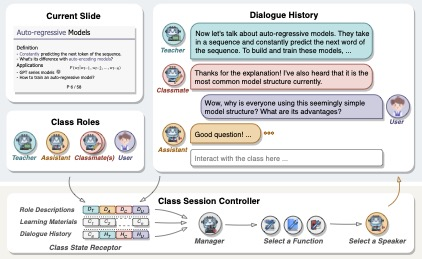

# SimClass
Code and data for the NAACL 2025 paper "Simulating Classroom Education with LLM-Empowered Agents"

</img> 

## Code <!-- omit in toc -->

SimClass is part of our MAIC platform, A Multi-agent Open Learning Platform for LLM Era's Online Education. Please refer to our project page [MAIC](https://github.com/THU-MAIC/MAIC-Core) for our implementation.

## Data <!-- omit in toc -->

The data will be released soon.

## Citation <!-- omit in toc -->

If you find our model/code/paper helpful, please consider cite our papers 📝 and star us ⭐️！

```bib
@article{zhang2024simulating,
  title={Simulating classroom education with llm-empowered agents},
  author={Zhang, Zheyuan and Zhang-Li, Daniel and Yu, Jifan and Gong, Linlu and Zhou, Jinchang and Liu, Zhiyuan and Hou, Lei and Li, Juanzi},
  journal={arXiv preprint arXiv:2406.19226},
  year={2024}
}
```

Other related papers

```bib
@article{yu2024mooc,
  title={From mooc to maic: Reshaping online teaching and learning through llm-driven agents},
  author={Yu, Jifan and Zhang, Zheyuan and Zhang-li, Daniel and Tu, Shangqing and Hao, Zhanxin and Li, Rui Miao and Li, Haoxuan and Wang, Yuanchun and Li, Hanming and Gong, Linlu and others},
  journal={arXiv preprint arXiv:2409.03512},
  year={2024}
}
```

```bib
@article{zhang2024awaking,
  title={Awaking the Slides: A Tuning-free and Knowledge-regulated AI Tutoring System via Language Model Coordination},
  author={Zhang-Li, Daniel and Zhang, Zheyuan and Yu, Jifan and Yin, Joy Lim Jia and Tu, Shangqing and Gong, Linlu and Wang, Haohua and Liu, Zhiyuan and Liu, Huiqin and Hou, Lei and others},
  journal={arXiv preprint arXiv:2409.07372},
  year={2024}
}
```

